# CI/CD_template

Итак вы решили задеплоить свой первый проект...

Мы будем это делать на примере питон 3.12 и простейшего фласк приложения
Деплоится будем на Яндекс клауде(Yandex Cloud) и Serverless Containers

Начнем с того что у нас есть почти готовый файл .yml для готового пайплайна
Он лежит в папке .github/workflows
Там будут коментарии которые понятны, и те которые будут требоавать дополнительных телодвижений.
В этом файле будут описаны подробные процессы для того чтобы настроить определенные параметры

Все моменты когда нужно смотреть в этот файл в yml помечены ("[[README_тема котору надо смотреть]]")
После изучения нужно затереть квадратные скобки и оставить только значение которое мы получили

# ПОЕХАЛИ

# CR_REGISTRY

Итак репозиторий для Docker образов.
Это место где будут хранится ваши образы.
Оно нужно чтобы всегда был доступ к старым версиям нашего кода внутри клауда
Итак настройка
Шаг 1. Создаем реестр для Docker образов
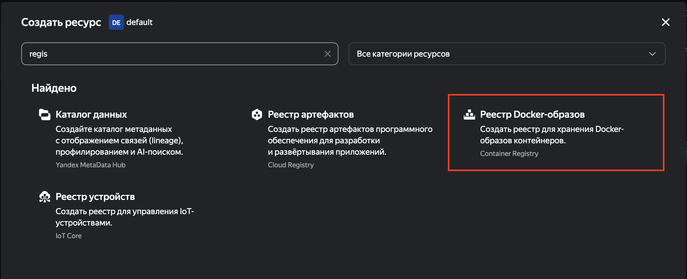

Шаг 2. Опять создаем реестр. Да опять, это приколы клауда я не при делах
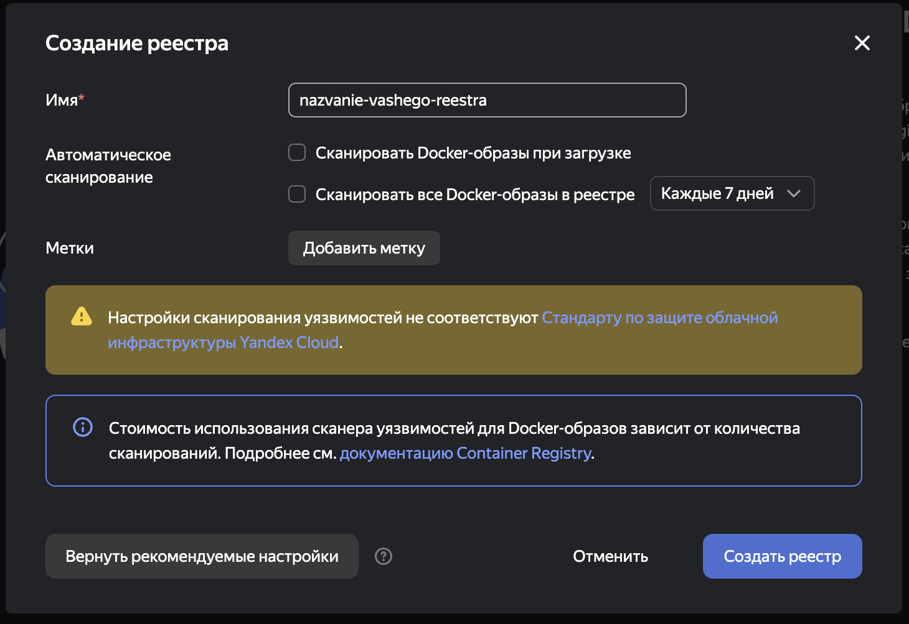
Вот тут нужно снять галочки о сканировании чтобы оно не жрало бабки

Шаг 3. Копируем id реестра
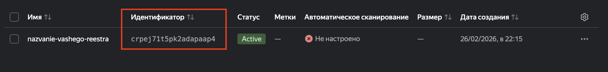

Шаг 4. Копируем название реестра
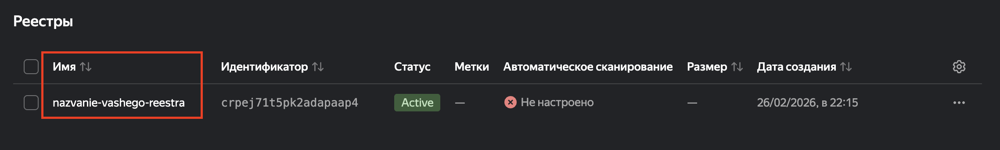

# Секреты GitHub

Секреты Гитхаб это секреты которые используются при выполнении пайплайна. Они хранятся внутри репозитория. Для каждого репозитория секреты свои.
Чтобы создать секрет переходим в настройки репозитория и переходим во вкладку

- Secrets and Variables
- - Actions
И создаем секрет формата ключ - значение
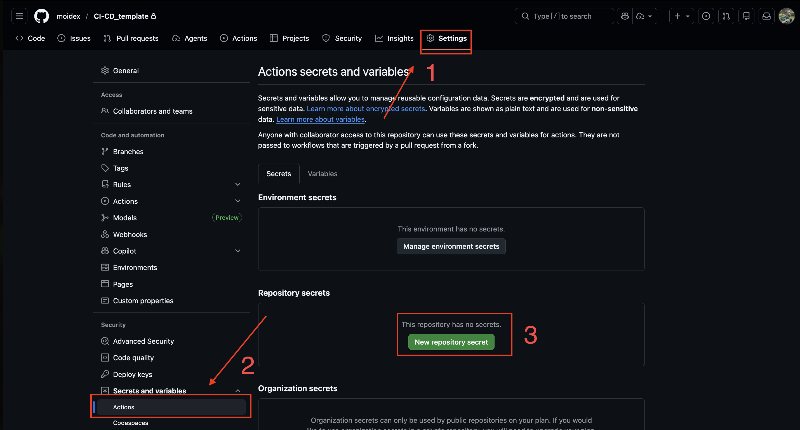

# Получение JSON авторизации для сервисного аккаунта

Итак, чтобы создать сервисный аккаунт нам нужно добавить новый сервис в клауд. Сокращенно он называется IAM полное название смотри на скриншоте
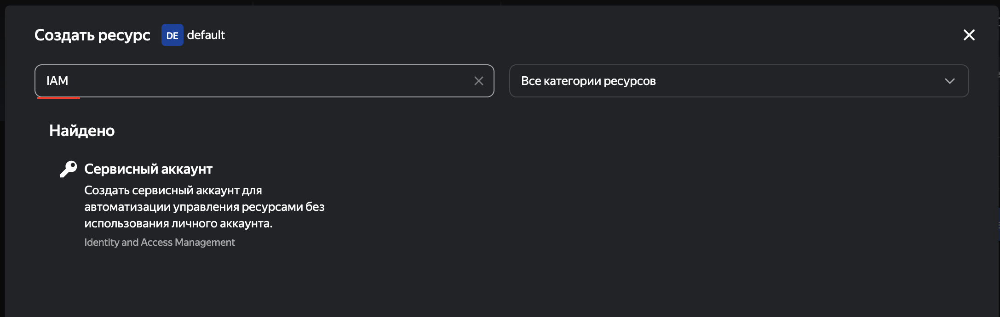
Дальше нам нужно создать сервисный аккаунт.
Мы рассмотрим самый простой путь, но он не является самым безопасным.
Создаем аккаунт. Вводим название, и выдаем права. Можно выдать права к конкретным сервисам, но мы дадим аккаунту просто права админа чтобы избежать головняка
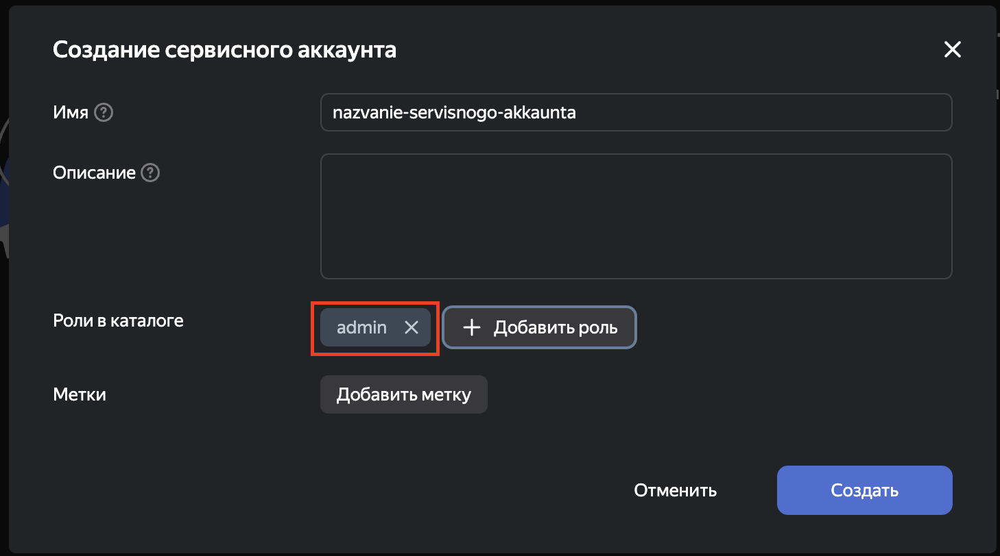

Дальше проваливаемся во внутрь только что созданного аккаунта
Нам нужно создать теперь ключ доступа. Жмем кнопки как на скриншоте
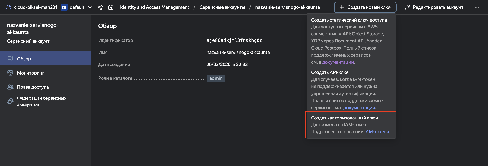
Во всплывшем окне оставляем все как есть, можно ввести описание ключа чтобы потом понимать какой ключ где используется.
У нас всплывает окно с ключами. В идеале их скачать, так как посмотреть их повторно не получится, если потеряете - придется пересоздавать


Теперь нужно пихнуть эти ключи в секреты. Как это сделать я описал выше

# Получение ID сервисного аккаунта

Ну тут все просто. Мы идем заходим в IAM и выбираем только что созданный сервисный аккаунт и копируем его id
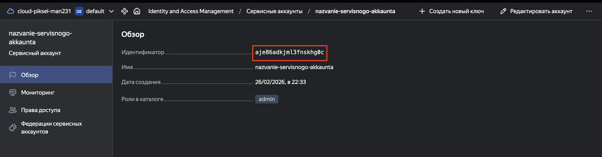

# Создание сети в Yandex Cloud

Итак что такое сеть в яндекс клауд и нафиг оно надо.
Сеть в клауде это сущность которая позволит вам настраивать вам правила подключения и настраивать роутинг

Шаг 1. Создание VPC
В целом очень просто и понятно делаем как на скриншотах
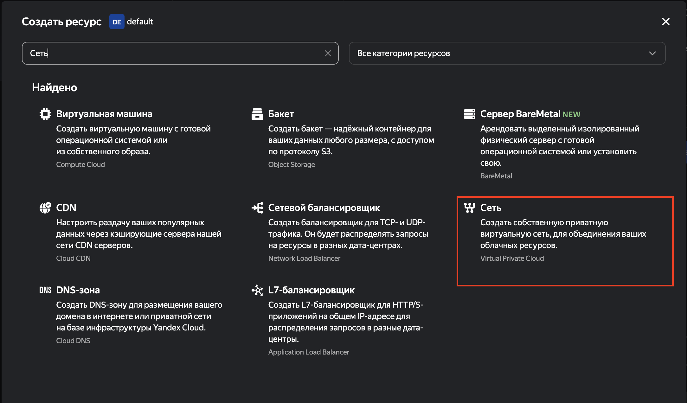
Шаг 2. Создание самой сети
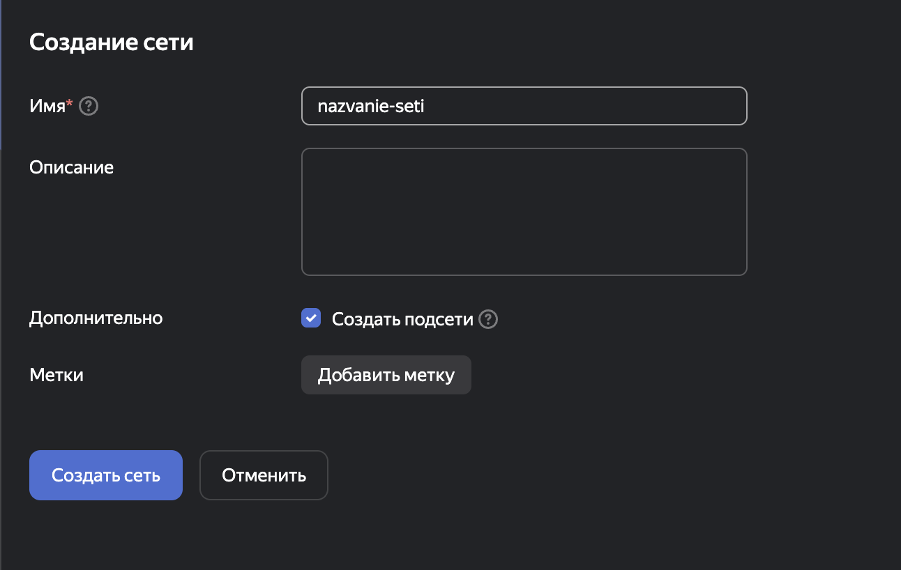
Готово. Остается скопировать id сети и вставить там где она нужна

# Создание Log группы

Итак представим что мы задеплоили 20 контейнеров. Чтобы нам не бегать и не искать логи по всем контейнеров создается так называемая лог группа. По факту это сборщик логов из нескольких мест
Итак бежим создавать

Шаг 1. Создаем ресурс
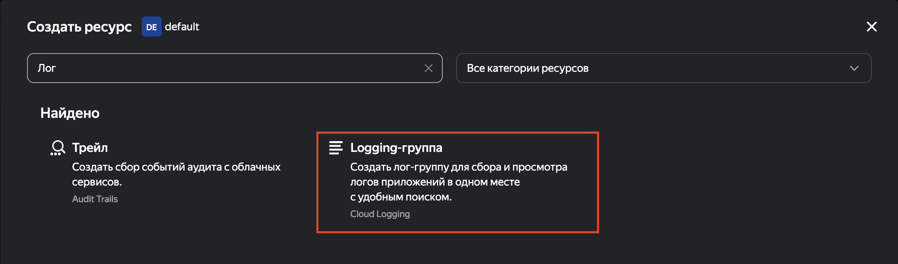
Шаг 2. Создаем Лог группу
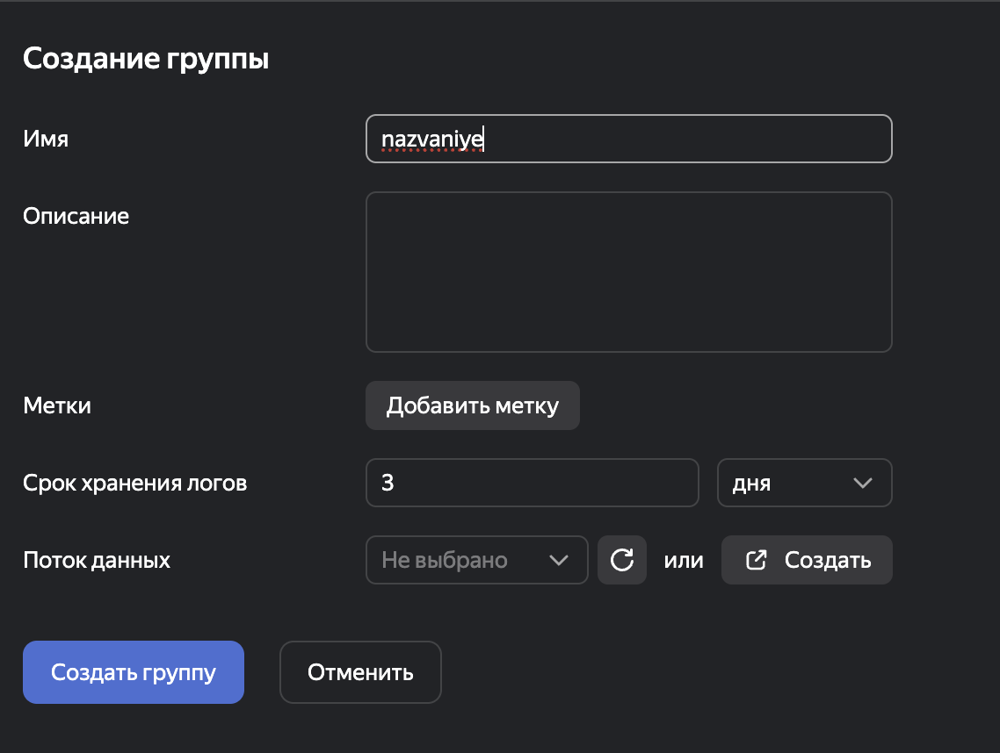
Шаг 3. Копируем ID и радуемся жизни

# Секреты для деплоя, id и ключ

Итак вы написали код. Но что делать с чувствительными ключами которые вам не хотелось бы чтобы попали в чужие лапки?
Правильно мы создаем секреты. Для этого у клауда есть отдельный сервис. Он называется Lockbox. Там можно хранить свои самые темные секреты и о них никто не узнает.
Так как этим пользоваться

Шаг 1. Создаем Lockbox
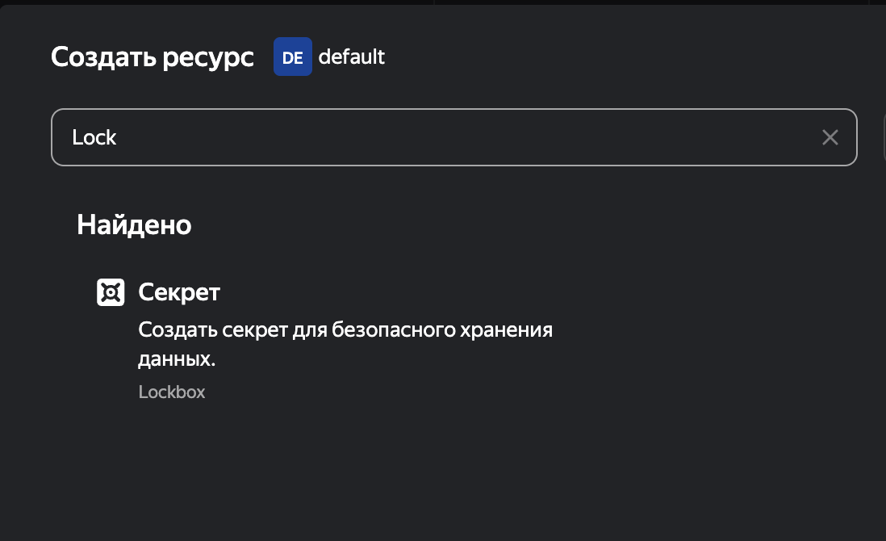
Шаг 2. Создаем секрет
Тут важно указать сразу что секрет пользовательский и задать один или несколько секретов. Можно создать пустой секрет, потом если что его удалим
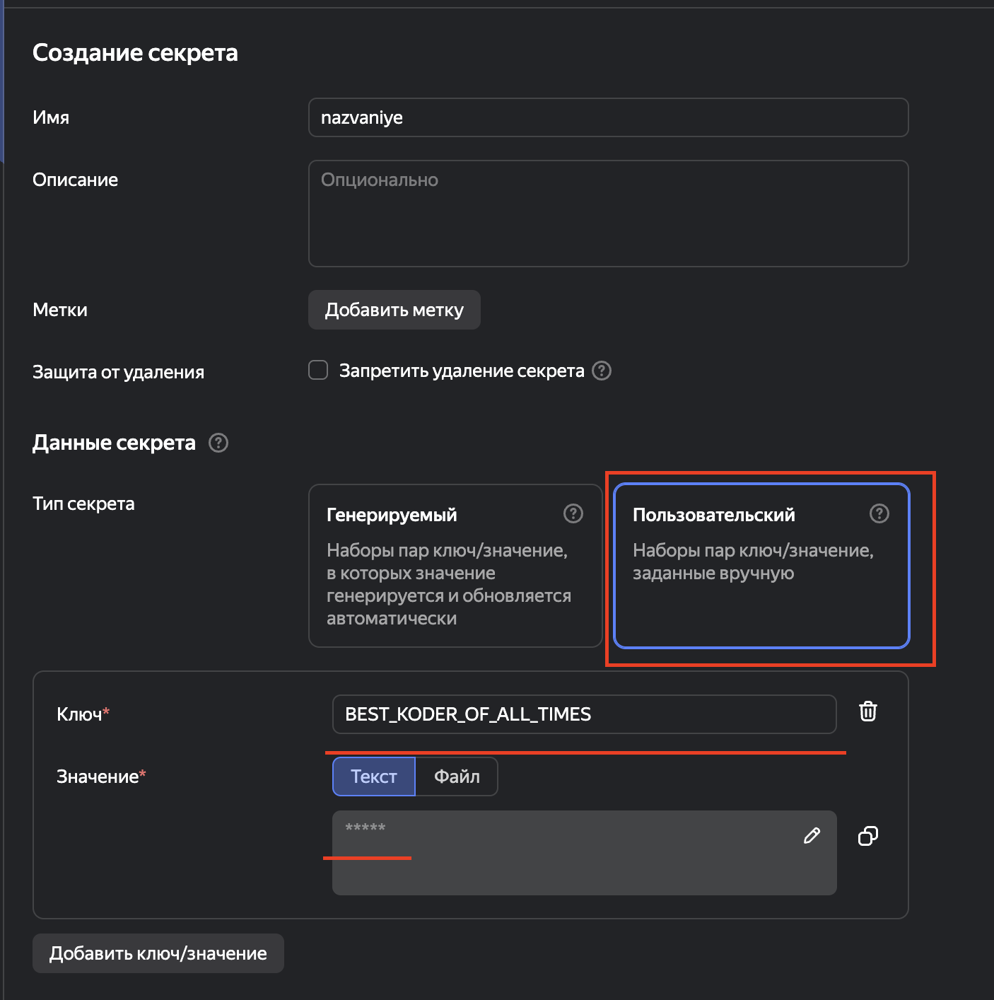
Шаг 3. Использование
Создать секрет мы создали, но теперь нам нужно его использовать
В самом проекте у нас по уму должен быть какой-то файлик где мы вытаскиваем переменные из окружения(оно же называется .env) и используем их позже
Пример есть в code/config.py

Окей, мы используем os.environ но он как там окажется?
А очень легко в ci.yml (файл пайплайна) мы на 69 строке начинаем указыать наши секреты
Пример как это может выглядеть на 70 строке
Разберем по порядку

```
secret environment-variable=BIG_SECRET,id=qwe123rty4567890,key=BIG_SECRET_LOCKBOX
```

Итак, у нас тут есть 3 изменяеых пары ключ-знвчение
environment-variable=BIG_SECRET - То как этот ключ будет записан в .env
id=qwe123rty4567890 - id Lockbox откуда мы берем секрет. Его нужно скопировать из панели клауда
key=BIG_SECRET - То как этот ключ называется в Lockbox

Если нам нужно добавить много ключей, то мы добавляем много ключей в Lockbox, а в yml файле мы добаляем несколько строк как мы указали выше, но важно чтобы у каждой не последней строки в конце было " \", иначе не взлетит
